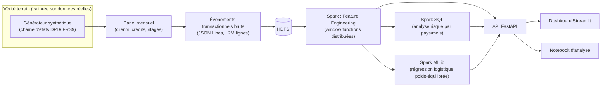

# EWS-Credit UMOA

**Système d'alerte précoce (Early Warning System) sur la dégradation d'un
portefeuille de crédits**, conforme aux exigences de provisionnement IFRS 9,
avec une chaîne de traitement distribuée complète : événements bruts → HDFS
→ Spark (feature engineering + SQL + Machine Learning) → API → dashboard.

## Pourquoi ce projet

Un département des Risques bancaire veut détecter les crédits qui vont se
dégrader **avant** l'incident de paiement, pas après — le tout sur un
portefeuille assez volumineux pour justifier un vrai traitement distribué
plutôt qu'un script pandas sur un CSV qui tient déjà en mémoire.

Aucune microdonnée individuelle de portefeuille de crédit UMOA n'est
publique (secret bancaire). Le portefeuille est donc **synthétique, mais
calibré sur de vraies données** : taux d'intérêt et taux de provisionnement
réels de la BCEAO (API DBnomics), fréquences de retard de paiement réelles
de Home Credit Default Risk, taux de défaut réel de l'African Credit
Scoring Challenge (microcrédit ouest-africain, licence MIT). Voir
[`data/README.md`](data/README.md) pour le détail des sources et le
raisonnement de calibration.

## Architecture



Le simulateur de portefeuille (`generation/`) est la **vérité terrain** :
calibrée, testée, elle ne change pas. Le flux d'événements qui en est dérivé
est volontairement non pré-agrégé — c'est ce que Spark retraite pour
reconstruire les features comportementales (retards consécutifs, tendance
de solde, ratio d'utilisation du découvert, fréquence d'incidents).

## Résultats

| | |
|---|---|
| Portefeuille | 15 000 clients, 18 391 crédits, 8 pays UMOA |
| Événements bruts générés | 2 029 561 (371 Mo, JSON Lines partitionné HDFS) |
| Features produites par Spark | 255 051 lignes (validé sur cluster réel : namenode/datanode/spark-master/spark-worker) |
| Taux de défaut cumulé (vérité terrain) | 3,9 % — cohérent avec l'ancrage réel (1,83 % sur prêts courts kényans) |
| **Modèle ML (régression logistique, Spark MLlib)** | **AUC-ROC 0,92** · rappel classe positive **78,6 %** · précision 7,6 % |

Le rappel élevé est le choix assumé pour un système d'*alerte* : mieux vaut
plus de faux positifs (filtrés ensuite par un analyste) que rater un vrai
risque de défaut. Détail complet et visualisations :
[`notebooks/analyse_exploratoire.ipynb`](notebooks/analyse_exploratoire.ipynb).

## Stack

Python 3.11 · Pandas/NumPy · **Hadoop HDFS** (namenode/datanode) ·
**Apache Spark 3.5** (DataFrame API, Spark SQL, MLlib) · FastAPI · Streamlit ·
Docker Compose · pytest.

## Démarrage rapide

### Démo (API + dashboard, sans le cluster Hadoop/Spark)

Le cluster Hadoop/Spark ne sert qu'au job **batch** de génération des
features ; l'API et le dashboard lisent son résultat déjà calculé.

```bash
docker compose up -d api dashboard
# API      : http://localhost:8000/docs
# Dashboard: http://localhost:8501
```

### Chaîne complète (régénérer les données et les features)

```bash
pip install -e ".[dev]"
python -m ews_credit.cli portfolio --n-clients 15000   # verite terrain (data/synthetic/)
python -m ews_credit.cli events                        # evenements bruts (data/raw/events/)

docker compose up -d namenode datanode spark-master spark-worker
docker/ingest_to_hdfs.sh                                # events + tables synthetiques -> HDFS
docker/run_spark_job.sh                                 # features (Spark, HDFS -> HDFS)

docker exec ews-spark-master /opt/spark/bin/spark-submit \
  --master spark://spark-master:7077 \
  /opt/spark/work-dir/src/ews_credit/spark_jobs/run_ml_pipeline.py \
  --racine-hdfs hdfs://namenode:9000                    # Spark SQL + ML + evaluation
```

### Tests

```bash
pip install -e ".[dev]"
pytest tests/domain -q            # regles metier pures, aucune dependance
docker/run_spark_tests.sh         # job Spark, dans les memes conditions que l'execution reelle
```

## Structure du projet

```
src/ews_credit/
├── config/          # constantes de calibration, chacune sourcee (BCEAO, Home Credit, ...)
├── domain/          # regles metier pures (IFRS9, transition DPD, scoring, provisionnement)
├── generation/       # simulateur de portefeuille (verite terrain) + flux d'evenements bruts
├── spark_jobs/       # feature engineering distribue, Spark SQL, pipeline ML
├── api/              # FastAPI : sert les resultats deja calcules
└── dashboard/        # Streamlit : consomme l'API (jamais les fichiers directement)

docker/                # Dockerfiles (spark, api, dashboard) + scripts d'ingestion/execution
notebooks/              # analyse exploratoire, autonome (ne depend pas de Spark/API actifs)
tests/                  # domain/ (pytest local) + spark_jobs/ (pytest en conteneur)
```

Chaque fichier `.py` reste volontairement court (largement < 100 lignes) :
une responsabilité par fichier, cohérent avec la séparation domaine /
génération / traitement distribué / service applicatif.

## Limites et perspectives

- Le score explicable (`domain/scoring.py`, règles pondérées) et le modèle
  entraîné (`spark_jobs/train_model.py`) coexistent volontairement : le
  premier est immédiatement auditable par un régulateur, le second capture
  un signal statistique plus riche. Un vrai déploiement combinerait les deux.
- Les taux de provisionnement par stage (`domain/provisionnement.py`) sont
  des ordres de grandeur usuels IFRS 9, pas une calibration BCEAO spécifique
  par stage (donnée non publique).
- Amélioration naturelle du modèle : un classifieur non linéaire (GBT) ou
  l'ajout de séries macro BCEAO en feature temporelle.

## Licence

MIT — voir [`LICENSE`](LICENSE).
